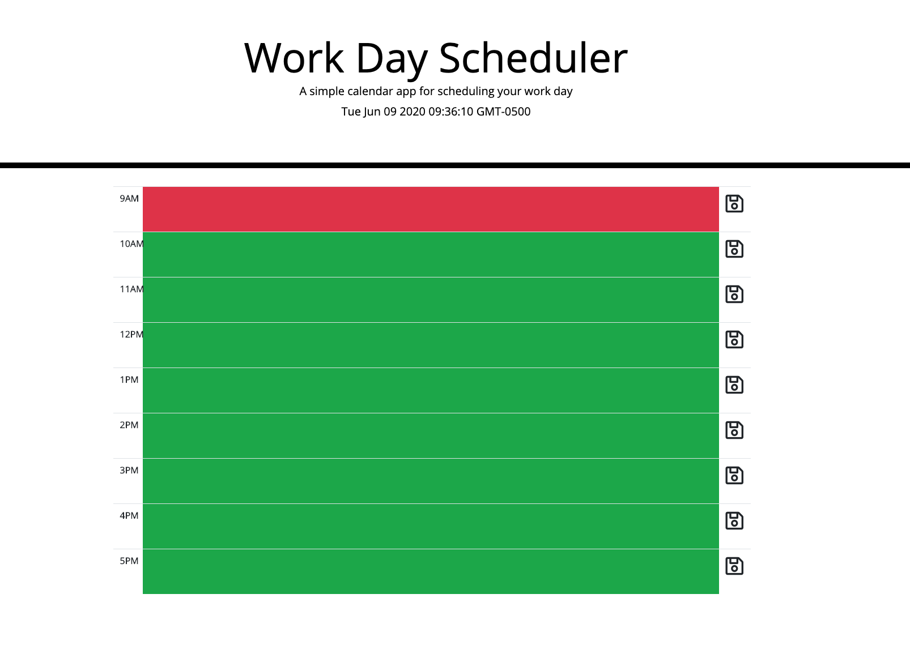

# work-day-scheduler
A simple calendar app for scheduling your work day.Time blocks change colors based on time of day and info gets stored in local storage once it is saved

HTML, CSS, JavaScript, JQuery, moment.js, event listeners and localStorage

https://cd-prog.github.io/work-day-scheduler/

